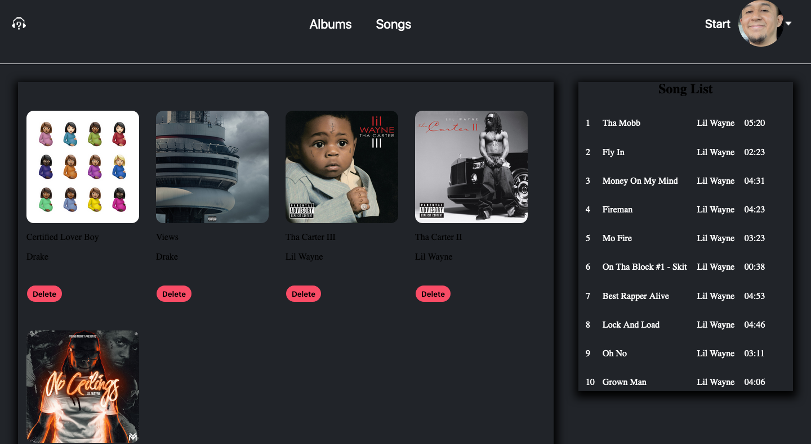

# Music Library App

### About the Project
Project was built with the following tools:  

- Javasript
- React
- Express
- Node Js
- PostgreSQL
- AWS S3  
- Scoket.IO
 

## Usage
This project was built to learn the usage of tokens combined with postgresql, as well as the usage of hashing user password. Web application allows user to create a profile, make calls to spotify API and search Artist's Albums and Songs.    

Users are able to add albums and songs to thier profile. AWS S3 bucket was used to upload image for user profile.    

Application is responsive as well being used in mobile and desktop.    

Lastly using Socket.IO to send updated like and comment count.

## Sign-up Page
  

## Profile Page

## Album Page
  

## Search Page

# Mobile Display

  

.  

